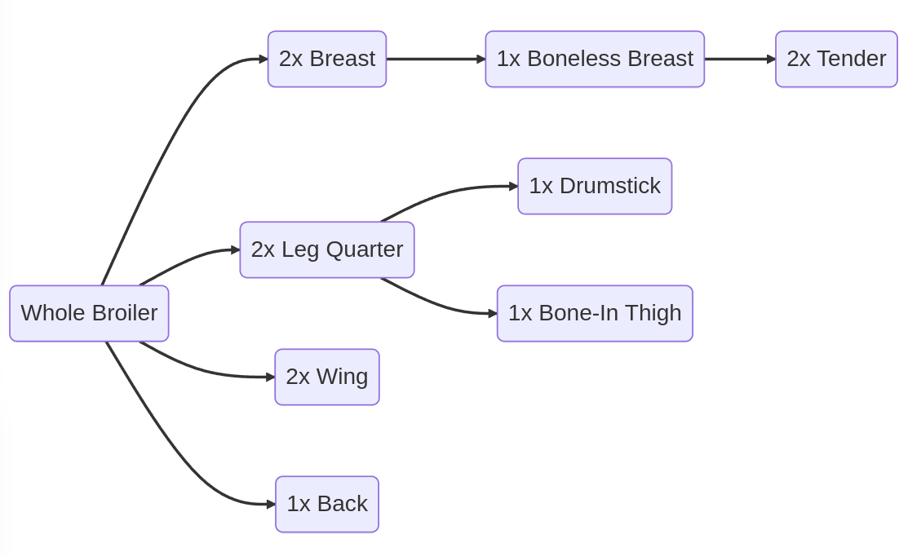

# Blackbird Data Modeling
## Workshop Details
__Date & Time:__ Wednesday, March 8th, 2023, 6 - 7 PM EST

__Location:__ [Jitsi Meet](https://meet.jit.si/skywoman-design-tech-incubator)

__Attendees:__ Chris, Connor, Trang, David, Laurel, Jamie

## Agenda
- Review primary requirements and features (see [below](#background--context))
  - Could it help to sketch out some user journeys for any of these?
- Data model
  - Main components:
    - Production plan
    - Production target
    - Inventory
  - What about sales projections, subscriptions, orders, etc?
- Prototyping
  - Any low-hanging fruit features that could be prototyped quickly, like dashboards or UI components?
  - Can Runrig be of any help here?

## Notes
- Chris: What would be some useful prototypes for Blackbird's requirements:
  - dead simple inventory tracking
  - "bundling" products, eg:
    - selection of white meat cuts
    - regular veggie combo
  - and allow those bundles to be inventoried
  - also track what production actions are required to meet that inventory, eg:
    - how many birds to kill, etc
    - what if you want to bump that up to 10%
  - and ultimately what is the unallocated inventory
- Jamie: Data Food Consortium / Open Food Network France is working on standards for representing farm product catalogs and inventory for short supply chains
  - Helpful links for reference:
    - [Overview of the Standard](https://www.datafoodconsortium.org/en/our-standard/)
    - [Business Ontology](https://datafoodconsortium.gitbook.io/dfc-standard-documentation/semantic-specifications/business-ontology)&dagger;
    - [Product Ontology](https://datafoodconsortium.gitbook.io/dfc-standard-documentation/semantic-specifications/product-ontology)
    - [Example Requests (JSON-LD)](https://datafoodconsortium.gitbook.io/dfc-standard-documentation/appendixes/practical-examples/version-1.8)
  - The [Food Data Collaboration](https://fooddatacollaboration.org.uk/), OFN-UK's counterpart to OFN France's DFC, is also contributing research
    - [Implementation Requirements](https://fooddatacollaboration.org.uk/what-does-it-mean-to-implement/)
  - OFN Canada has also initialized similar research, with a forthcoming report on the interoperability of various food e-commerce platforms.
- David started a database table diagram
  - https://dbdiagram.io/d/5f3835c7e1246d54aa2d7020
- We also played around with Mermaid flowcharts
  - [Flowchart](https://mermaid.live/edit#pako:eNplkD1rwzAQhv_KoekCydBv8FCI47FDIYUOdgfFOlvCsmT0UVPi_PfKTalTcpP0PO9xJx1ZbQWxjDXajrXkLsBbURlItS1f1CfBTqq6I_MBm83z1FLwIIiLCfLyXVq9-HNT_hPriAYYZz3BrtyT1sA95M4qTe5f8uCId6ACCDuaCV7TAv7s5_Lx0Do-yEte3CDOXT741eoX3SKOyrQLuEPUdHmfh0FxjxikauWVeEAULvZX_BGxIQp_-AmxVQdNy2wyojJszXpyPVci_eRxFhULknqqWJaOghoedahYZU4pymOw-y9Tsyy4SGsWB8EDFYqnt_Ysa7j2dPoGUlZ8SA) Jamie was experimenting with to visualize the processes and decision tree when allocating product
  - David shared an image generated from a flowchart he developed&ddagger;

*******

&dagger;: Example diagram of the DFC's Business Ontology:

&ddagger;: David provided this flowchart for processing chickens:

## Background & context
Chris's initial call-to-action from the DTI Discord channel, with 6 high-level features and/or requirements:

> I'm about to start working on my own custom app for handling sales both front and back of house. I just completed a time-audit of the largely manual AirTable/Google Form/Square/JS orgy of technical debt I'm using to manage this stuff and now I'm... upset. I'm looking at:
> 
> 1. A mobile and web app for allowing people to sign up for CSA subscriptions (with our proprietary model that allows people to have different shares delivered on different schedules) and ad-hoc sales for both retail and wholesale. And determining based on delivery address whether or not people are in our service range.
> 
> 2. Automatically nudge subscribers toward cost savings by optimizing their delivery schedules and such, and also allows subscriptions to be put together based on budgets and preferences (e.g. "I can't spend more than $90/month and I really like ribeyes; gimme some options")
> 
> 3. Integrate in real time with our routing software (OptimoRoute), and allow people to shift delivery dates, combine or redirect orders, etc.
> 
> 4. Provide some business intelligence: specifically, using subscription data to provide a dashboard of necessary production and purchases from partner farms, and the ability to forecast profitability by comparing production costs with sales
> 
> 5. Possibly integrate with a CRM like Salesforce to improve customer capture
> 
> 6. Double bonus: coding up our own payment gateway, which could save us a small fortune in revenue (Square/Stripe fees are going to cost us $20K+ this year).
> 
> Ideally this system will allow me to retire Square, AirTable, Google Forms, Integromat/Make, Stripe, the handful of scripts making it all work together, and my part-time IT job coordinating it all.
> 
> My specific ask is this: I am absolute sh*t with UI stuff, and have no mobile chops whatsoever. I can hold my own with algorithms, data schemas, cloud, web services, and other backend stuff... so I could definitely use some help from someone with experience in React, Angular, Swift, XCode, etc.
> 
> I'd like to set this up as a separate service that Sylvanaqua / Blackbird both pays for an co-owns along with whatever other developers help put it together.
> 
> Anybody wanna get to hacking?

Following up on this...
- Chris shared this design doc with more details: [Blackbird app (Google Doc)](https://docs.google.com/document/d/1V7Cg7xsKQCnVm2NOjuXMy5Xu_wBxfXTP5pGGN116lpo/edit)
- Kickoff meeting includes extensive discussion of the features and requirements as well: [Notes for Skywoman DTI Call Mar 2 (Google Doc)](https://docs.google.com/document/d/1C3SZ4gR8RD8RZjcHvp8YXCF2GlRSH7nDZxLneYSXQSs/edit#)

